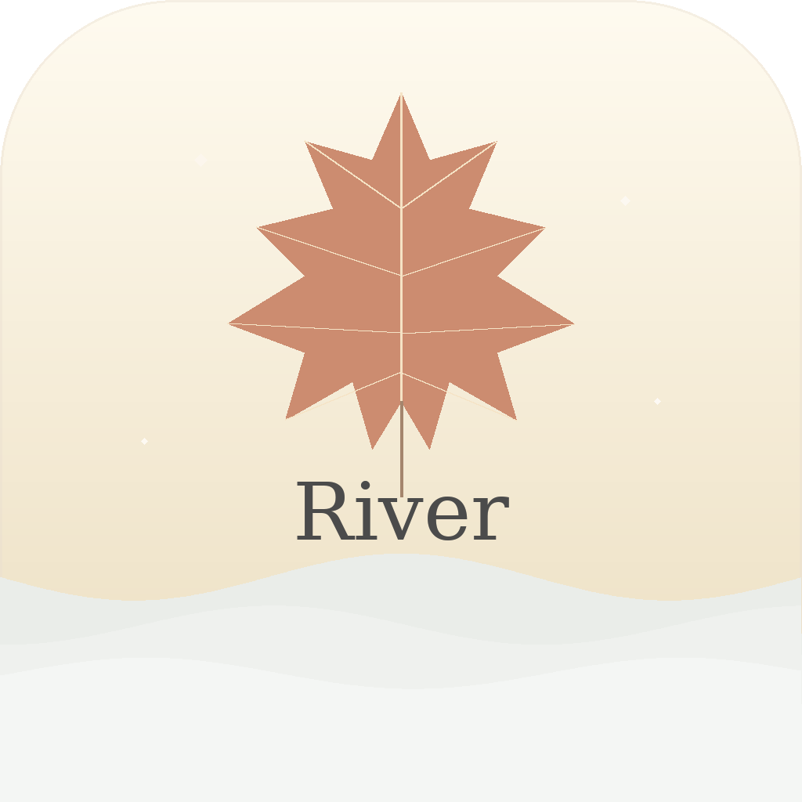
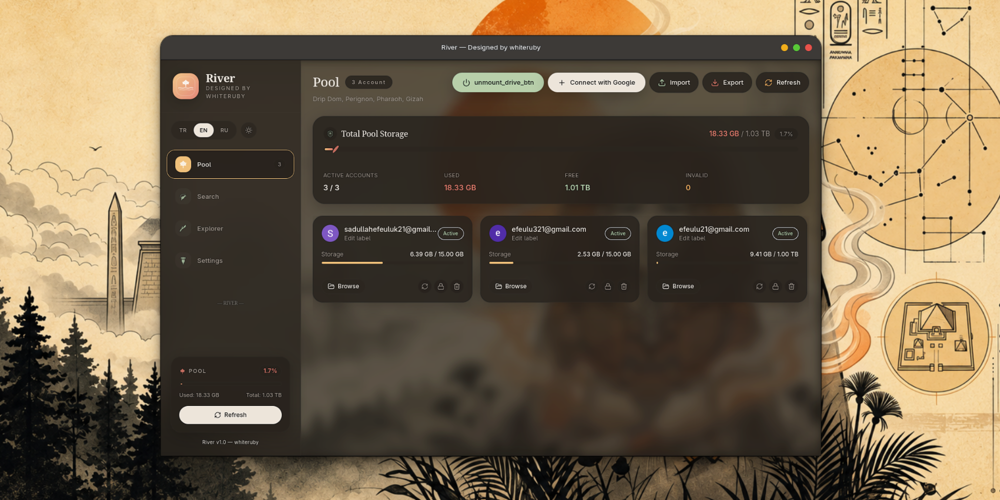
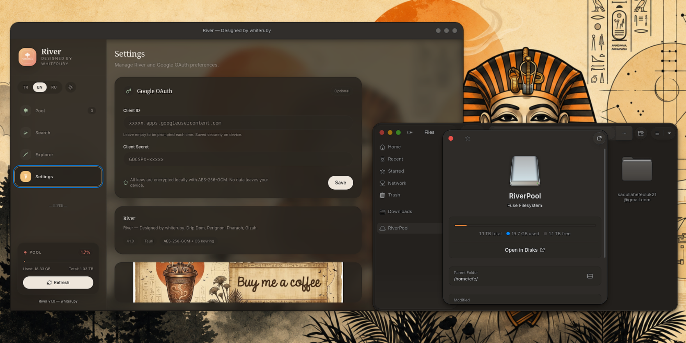
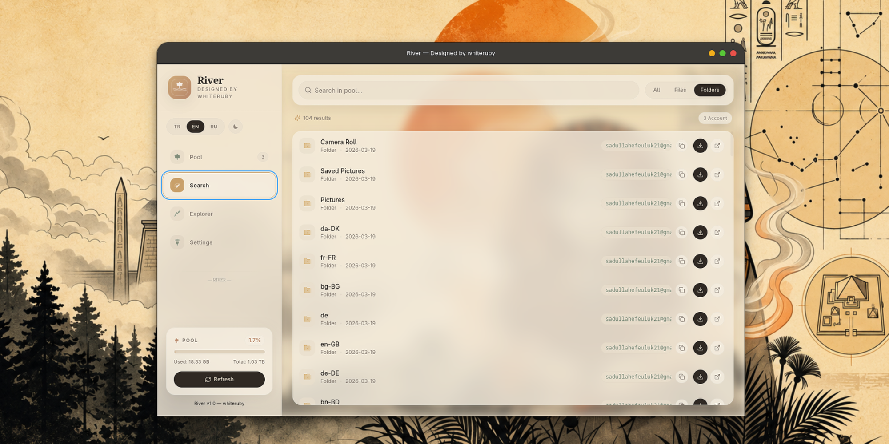

<p align="center">
  <br>
  <a href="#features">Features</a> •
  <a href="#binary-download">Downloads</a> •
  <a href="#raw-steps-to-build">Build</a> •
  <a href="#file-structure">Structure</a> •
  <a href="#security--privacy">Security</a> •
  <a href="#screenshots">Screenshots</a><br>
  [<a href="README.md">English</a>] | [<a href="README.md">Türkçe</a>]
</p>

[](LICENSE)
[](https://www.rust-lang.org/)
[](https://tauri.app/)
[]()
[](https://buymeacoffee.com/whiteruby)

Yet another cloud pooling solution, written in **Rust** and **Tauri v2**. Works out of the box with zero configuration required. You have full control over your storage, aggregating multiple Google Drive accounts into one massive, unified, high-performance virtual drive mounted directly onto your operating system.

<p align="center">
  <a href="https://buymeacoffee.com/whiteruby" target="_blank">
    
  </a>
</p>



River welcomes contributions from everyone.

[**FAQ**](https://github.com/whiterruby/River/wiki/FAQ)

[**BINARY DOWNLOAD**](#binary-download)

[**NIGHTLY BUILD**](https://github.com/whiterruby/River/releases)

---

## Features

- **Multi-Account Quota Aggregation:** Merge unlimited Google Drive accounts into a unified pool (e.g. 10 accounts x 15 GB = 150 GB Pool).
- **Native Virtual Disk Mount (FUSE):** Mount your multi-account pool directly to your local file system (`~/RiverPool` on Linux/macOS or `R:\` on Windows).
- **Sub-Millisecond File Browsing:** Fast local SQLite caching combined with Linux Kernel VFS cache (zero folder lag).
- **Live Media & Video Thumbnails:** Native high-resolution Google Drive thumbnail previews for visual searching.
- **Enterprise-Grade Cryptography:**
  - **AES-256-GCM** local database encryption.
  - **Argon2id** password derivation for encrypted backup export/import.
  - **OS Keyring** integration (Linux Secret Service / Apple Keychain / Windows Credential Manager).
  - Cryptographically randomized **PKCE verification** for OAuth flow.
- **Integrated Stream Server:** Stream high-definition videos and audios directly without downloading first.

---

## Binary Download

Pre-built native packages are automatically generated for all architectures:

| Platform | Architecture | Package Format |
| :--- | :--- | :--- |
| **Linux (Universal)** | x86_64, aarch64 | [`.AppImage`](https://github.com/whiterruby/River/releases) |
| **Ubuntu / Debian / Mint** | x86_64, arm64 | [`.deb`](https://github.com/whiterruby/River/releases) |
| **Fedora / RHEL / openSUSE**| x86_64 | [`.rpm`](https://github.com/whiterruby/River/releases) |
| **macOS (Apple Silicon)** | M1 / M2 / M3 / M4 | [`.dmg`](https://github.com/whiterruby/River/releases), [`.app.tar.gz`](https://github.com/whiterruby/River/releases) |
| **macOS (Intel)** | x86_64 | [`.dmg`](https://github.com/whiterruby/River/releases), [`.app.tar.gz`](https://github.com/whiterruby/River/releases) |
| **Windows** | x64, arm64 | [`-setup.exe` (NSIS)](https://github.com/whiterruby/River/releases), [`.msi`](https://github.com/whiterruby/River/releases) |

---

## Dependencies

The desktop version uses **Tauri v2** + **React 18** for the GUI and **Rust** for the backend FUSE engine.

### Linux Prerequisites

#### Ubuntu 20.04 / 22.04 / 24.04 (Debian)
```sh
sudo apt update && sudo apt install -y \
  build-essential curl wget git pkg-config \
  libwebkit2gtk-4.1-dev libgtk-3-dev libappindicator3-dev \
  librsvg2-dev patchelf libfuse3-dev fuse3
```

#### Fedora / RHEL / CentOS
```sh
sudo dnf install -y \
  gcc gcc-c++ make git curl pkg-config \
  webkit2gtk4.1-devel gtk3-devel libappindicator-gtk3-devel \
  librsvg2-devel fuse3-devel fuse3
```

#### Arch Linux / Manjaro
```sh
sudo pacman -Syu --needed \
  base-devel curl wget git pkgconf \
  webkit2gtk-4.1 gtk3 libappindicator-gtk3 \
  librsvg fuse3
```

---

## Raw Steps to build

- Install [Node.js](https://nodejs.org/) (v20+) and [pnpm](https://pnpm.io/)
- Install [Rust toolchain](https://rustup.rs/):
  ```sh
  curl --proto '=https' --tlsv1.2 -sSf https://sh.rustup.rs | sh
  source $HOME/.cargo/env
  ```
- Clone repository & install frontend dependencies:
  ```sh
  git clone https://github.com/whiterruby/River.git
  cd River
  pnpm install
  ```
- Run in Development Mode:
  ```sh
  pnpm tauri dev
  ```
- Build Production Release:
  ```sh
  pnpm tauri build
  ```

---

## File Structure

- **[src-tauri/src/fuse_mount.rs](src-tauri/src/fuse_mount.rs)**: High-performance FUSE filesystem driver (caching, directory trees, file stream I/O).
- **[src-tauri/src/google_api.rs](src-tauri/src/google_api.rs)**: Google Drive API integration, chunked file uploaders, token refresh routines.
- **[src-tauri/src/db.rs](src-tauri/src/db.rs)**: SQLite local database with AES-256-GCM record-level encryption.
- **[src-tauri/src/crypto.rs](src-tauri/src/crypto.rs)**: OS Keychain integration, master key derivation, and Argon2id export security.
- **[src-tauri/src/stream_server.rs](src-tauri/src/stream_server.rs)**: Local HTTP range-request video/audio streaming proxy.
- **[src-tauri/src/commands.rs](src-tauri/src/commands.rs)**: Tauri IPC command handlers.
- **[src/](src/)**: React + TypeScript frontend (Vite, TailwindCSS, Zustand state manager).
- **[.github/workflows/release.yml](.github/workflows/release.yml)**: Cross-platform matrix builder (Linux, macOS, Windows).

---

## Security & Privacy

1. **Local-Only Architecture:** OAuth authentication and file proxies bind exclusively to loopback (`127.0.0.1`).
2. **Encrypted at Rest:** All client secrets, access tokens, and file metadata in SQLite are AES-256-GCM encrypted.
3. **No Intermediate Backend:** Direct peer connection between your computer and Google Cloud endpoints.

---

## Screenshots

| Pool & Accounts Overview | Unified File Explorer & Thumbnails |
| :---: | :---: |
|  |  |

| Settings & Security (Light/Dark Theme) |
| :---: |
|  |

---

## License

This project is licensed under the **MIT License** - see the [LICENSE](LICENSE) file for details.

Developed with ❤️ by **whiteruby**.
